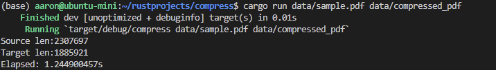

# Rust Tutorials

## Rust installation

- [Windows](https://www.rust-lang.org/tools/install)
- [Ubuntu](https://www.journaldev.com/39960/install-rust-on-ubuntu-linux)

### Ubuntu usage quick reference

```bash
curl https://sh.rustup.rs -sSf | sh  # installation
source $HOME/.cargo/env  # configure current shell
rustc --version  # check rust version
cargo --version  # check cargo (Rust's package manager) version
cargo build  # build the project
rustup update  # update rust
```

#### setup directory

```bash
mkdir ~/rustprojects  # make a rust directory
cd ~/rustprojects
mkdir testdir  # make a dir for test code
```

#### add some code

```bash
cd testdir
vi main.rs  # create test app
```

> ```rust
> fn main() {
>     println!("Hello, World!");
> }
> ```

#### compile & run the code

```bash
rustc main.rs  # compile test app
./main  # run test app
```

### Alternative Rust build & Run using Cargo

```bash
cargo new hello-world  # create and setup and new project (like 'go mod init')
cargo run  # build and run the code
```

## Uninstall Rust

```bash
rustup self uninstall  # uninstall rust
```

NOTE: be sure to run `cargo build` after adding dependencies in the *Cargo.toml* file

---

## Project Group A

Based on this [video series](https://www.youtube.com/playlist?list=PL5dTjWUk_cPaPhW2SQ1OCNwu3h8D9dYHh)

### 1. First test project `"Hello, Rustaceans!"`

OUTPUT:

```bash
aaron@ubuntu-mini:~/rustprojects/akhil-first-proj$ cargo run
   Compiling akhil-first-proj v0.1.0 (/home/aaron/rustprojects/akhil-first-proj)
    Finished dev [unoptimized + debuginfo] target(s) in 0.62s
     Running `target/debug/akhil-first-proj`
 ___________________________
< Hello, fellow rustaceans! >
 ---------------------------
        \
         \
            _~^~^~_
        \) /  o o  \ (/
          '_   -   _'
          / '-----' \
```

### 2. Rust variables and mutability (mut)

Variables in Rust are immutable unless defined using the `mut` keyword.

### 3. Scope and Shadowing

### 4. Destructuring

### 5. Data Types

---

### Rust compression



---
